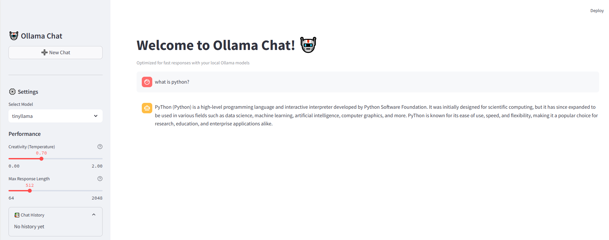

# Chatbot-ollama
# Ollama Chatbot

A local chatbot web application powered by Streamlit (frontend) and FastAPI (backend), using Ollama models for fast, context-aware conversations.

## Features

- **Chat UI**: Modern, interactive chat interface with conversation memory.
- **Multiple Models**: Easily switch between models like `tinyllama`, `llama2`, `mistral`, and more.
- **Performance Controls**: Adjust creativity (temperature) and response length.
- **Chat History**: View your previous questions and answers in the sidebar.
- **Local Inference**: All model inference runs locally via Ollama.

## Requirements

- Python 3.8+
- Ollama installed and running locally (see: [Ollama documentation](https://ollama.com/))
- The following Python packages (see `requirements.txt`):

  ```
  streamlit==1.40.2
  streamlit-chat==0.1.1
  ollama==0.1.8
  pyyaml==6.0.2
  streamlit-authenticator==0.4.1
  fastapi
  uvicorn
  requests
  pydantic
  ```

## Installation

1. **Clone the repository** and navigate to the project directory.

2. **Install dependencies**:

   ```bash
   pip install -r requirements.txt
   ```

3. **Ensure Ollama is running** and your desired models are available.

## Usage

### Start Everything (Recommended)

Simply run:

```bash
python run_all.py
```

This will automatically start both the FastAPI backend and the Streamlit frontend. The chat UI will open in your browser.

---

### (Advanced) Start Components Manually

If you want to run the backend and frontend separately:

#### 1. Start the FastAPI backend

```bash
uvicorn api:app --reload
```

#### 2. Start the Streamlit frontend

```bash
streamlit run app.py
```

---

## How it Works

- The **Streamlit app** (`app.py`) provides the chat interface and sends your messages to the FastAPI backend.
- The **FastAPI backend** (`api.py`) receives chat requests, forwards them to the Ollama model, and streams back the response.
- **Conversation context** is maintained during your session, so the model can generate context-aware replies.

## Customization

- **Models**: Add or remove model names in the `app.py` sidebar selectbox.
- **Performance**: Adjust temperature and max tokens in the sidebar for more creative or concise responses.

## Troubleshooting

- Make sure Ollama is running and the models you want to use are downloaded.
- If you encounter CORS issues, check the `allow_origins` setting in `api.py`.
- For package errors, ensure all dependencies are installed with the correct Python version.

## chatbot interface:



.png "Chat UI")

